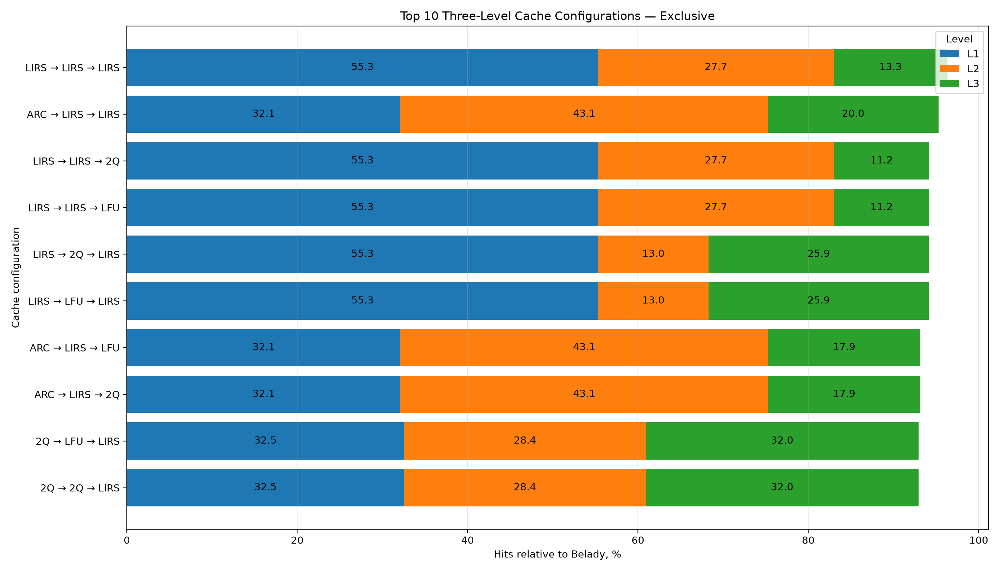
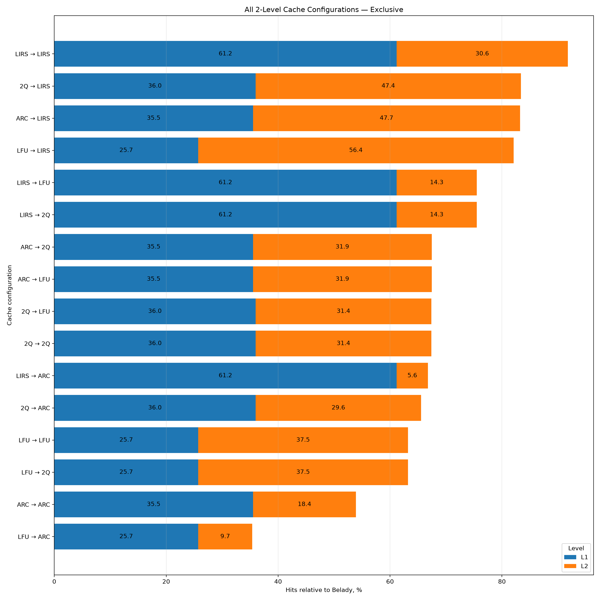
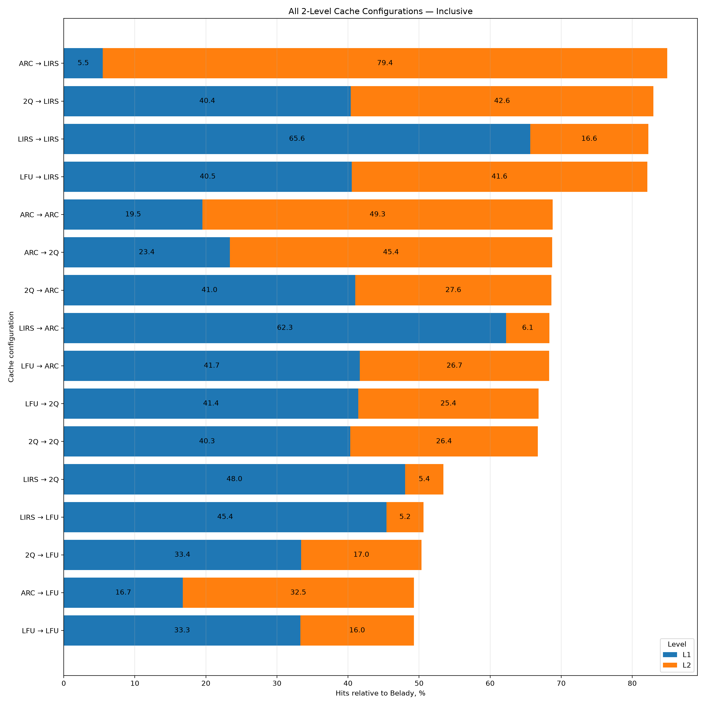
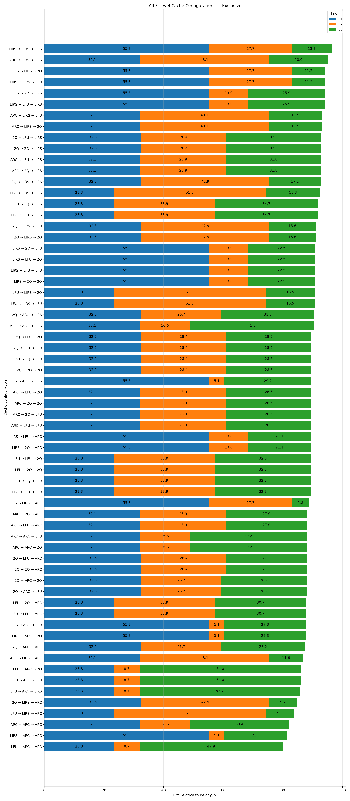
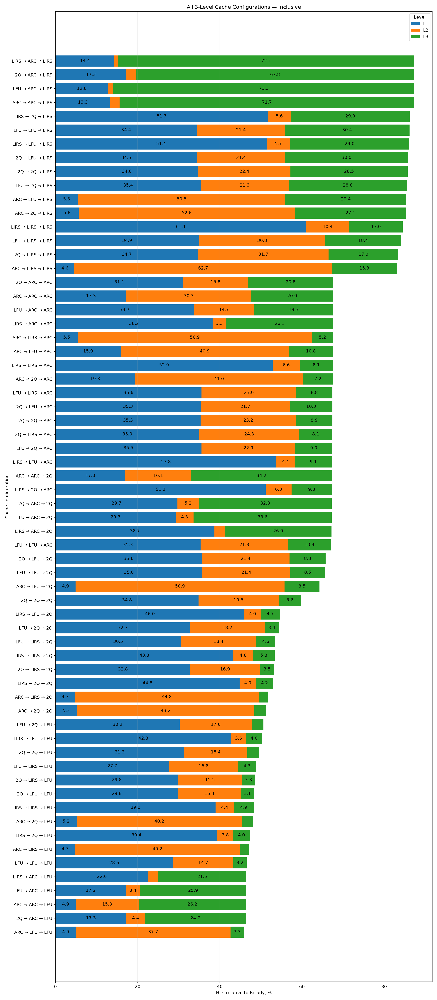
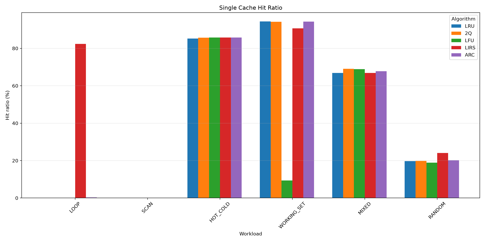

# Cache Simulator

Симулятор кешей на C++, реализующий пять алгоритмов вытеснения и многоуровневую организацию кеша.

## Возможности

- LRU — Least Recently Used
- LFU — Least Frequently Used
- 2Q — Two Queues
- ARC — Adaptive Replacement Cache
- LIRS — Low Inter-reference Recency Set
- одноуровневые и многоуровневые кеши
- произвольное количество уровней кеша
- Exclusive и Inclusive организация многоуровневого кеша
- подсчёт `Hits` и `Misses` для каждого уровня
- моделирование медленной памяти
- бенчмарки различных конфигураций кеша
- сравнение с оптимальным алгоритмом Belady
- построение графиков результатов

## Структура проекта

    .
    ├── include/
    │   ├── cache.hpp
    │   └── cache_api.hpp
    ├── src/
    │   ├── cache_api.cpp
    │   └── main.cpp
    ├── benchmarks/
    │   ├── benchmark.cpp
    │   ├── plot_benchmarks.py
    │   ├── benchmarks.csv
    │   └── plots/
    ├── txt/
    │   └── input.txt
    ├── Makefile
    └── README.md

## Сборка

Для сборки проекта используется `Makefile`.

    make

Для удаления файлов сборки:

    make clean

## Запуск симулятора

По умолчанию программа использует файл:

    txt/input.txt

Запуск:

    ./build/cache

Также можно передать собственный входной файл:

    ./build/cache path/to/input.txt

## Формат входного файла

Первая строка содержит количество уровней кеша.

Затем для каждого уровня указывается алгоритм и размер кеша:

    <algorithm> <capacity>

После описания всех уровней идёт последовательность обращений к страницам.

Пример:

    3
    lru 10
    arc 20
    lirs 30
    1 2 3 4 5 1 2 6 7 1 8 9 2 3

В данном примере создаётся трёхуровневый кеш:

    L1: LRU  — capacity 10
    L2: ARC  — capacity 20
    L3: LIRS — capacity 30

Поддерживаемые алгоритмы:

    lru
    lfu
    2q
    arc
    lirs

Размер кеша должен быть положительным.

## Архитектура

Все алгоритмы кеширования реализуют общий интерфейс:

    cache_interface<KeyT, ValueT>

Интерфейс предоставляет основные операции:

    lookup()
    insert()
    erase()
    print_cache()

Многоуровневый кеш реализован в классе:

    multi_cache_t

Благодаря общему интерфейсу `multi_cache_t` не зависит от конкретного алгоритма кеширования.

Общая структура:

                 multi_cache_t
                       |
          +------------+------------+
          |            |            |
         L1           L2           L3
          |            |            |
        LRU          ARC          LIRS

Каждый уровень может использовать собственный алгоритм кеширования.

## Одноуровневый кеш

В одноуровневом кеше используется один экземпляр выбранного алгоритма.

Например:

    LRU
     |
     v
    cache

Для каждого обращения проверяется наличие страницы в кеше.

При попадании увеличивается счётчик `Hits`.

При промахе страница загружается из медленной памяти и помещается в кеш.

## Многоуровневый кеш

В многоуровневом кеше запрос последовательно проверяет уровни:

    request
       |
       v
      L1
       |
     miss
       v
      L2
       |
     miss
       v
      L3
       |
     miss
       v
    slow memory

Если страница не найдена ни на одном уровне, она загружается из медленной памяти.

Проект поддерживает два способа организации многоуровневого кеша:

- Exclusive
- Inclusive

## Exclusive

В режиме **Exclusive** одна страница физически находится только на одном уровне кеша.

Например:

    L1: [1 2 3]
    L2: [4 5 6]
    L3: [7 8 9]

Если страница `5` найдена в L2, она перемещается в L1:

    L2 → L1

Если при вставке в L1 происходит вытеснение страницы, она передаётся на следующий уровень:

    L1 → L2 → L3

Таким образом, одна страница не хранится одновременно на нескольких уровнях.

Преимущество такого подхода заключается в том, что суммарная ёмкость уровней используется без дублирования страниц.

## Inclusive

В режиме **Inclusive** нижние уровни содержат копии страниц верхних уровней.

Для трёх уровней выполняется инвариант:

    L1 ⊆ L2 ⊆ L3

Например:

    L1: [1 2]
    L2: [1 2 3 4]
    L3: [1 2 3 4 5 6]

Если страница найдена на нижнем уровне, она может быть добавлена в верхние уровни.

Если страница вытесняется из нижнего уровня, соответствующие копии этой страницы в верхних уровнях удаляются.

## Алгоритмы кеширования

### LRU

**Least Recently Used**

Вытесняет страницу, которая дольше всего не использовалась.

### LFU

**Least Frequently Used**

Вытесняет страницу с наименьшей частотой обращений.

### 2Q

**Two Queues**

Использует несколько очередей для разделения недавно добавленных и часто используемых страниц.

### ARC

**Adaptive Replacement Cache**

Адаптивно балансирует между недавно использовавшимися и часто использовавшимися страницами.

В реализации используются структуры:

    T1
    T2
    B1
    B2

### LIRS

**Low Inter-reference Recency Set**

Использует информацию о расстоянии между обращениями к страницам для определения того, какие страницы следует сохранять в кеше.

## Статистика

Для каждого уровня ведётся отдельная статистика.

Подсчитываются:

- `Hits` — количество попаданий;
- `Misses` — количество промахов.

Пример:

    L1:
        Hits: 120
        Misses: 80

    L2:
        Hits: 50
        Misses: 30

    L3:
        Hits: 10
        Misses: 20

Также можно вывести текущее содержимое уровней кеша.

## Медленная память

Если запрашиваемая страница отсутствует во всех уровнях кеша, она загружается из медленной памяти.

Медленная память моделируется внутри `multi_cache_t`.

Для каждой страницы сохраняется соответствующее значение, поэтому повторные обращения к одной странице получают то же значение.

## Бенчмарки

Для исследования производительности реализована отдельная система бенчмарков.

Основной файл:

    benchmarks/benchmark.cpp

Для запуска бенчмарков используется:

    make benchmarks

Рассматриваются:

- одноуровневые кеши;
- двухуровневые кеши;
- трёхуровневые кеши;
- Exclusive организация;
- Inclusive организация;
- различные комбинации алгоритмов на уровнях.

Используются следующие рабочие нагрузки:

    LOOP
    SCAN
    HOT_COLD
    WORKING_SET
    MIXED
    RANDOM

Результаты сохраняются в:

    benchmarks/benchmarks.csv

CSV содержит информацию о:

- конфигурации кеша;
- алгоритмах на уровнях;
- режиме организации;
- количестве попаданий;
- отношении попаданий;
- результате Belady;
- эффективности;
- количестве попаданий на каждом уровне.

## Построение графиков

Для построения графиков используется:

    benchmarks/plot_benchmarks.py

Полный запуск бенчмарков выполняется командой:

    make benchmarks

Графики сохраняются в:

    benchmarks/plots/

Основные графики:

    single_cache_comparison.png

    top_10_two_level_exclusive.png
    top_10_two_level_inclusive.png

    top_10_three_level_exclusive.png
    top_10_three_level_inclusive.png

    all_2_level_exclusive.png
    all_2_level_inclusive.png

    all_3_level_exclusive.png
    all_3_level_inclusive.png

Для многоуровневых конфигураций графики показывают вклад L1, L2 и L3 относительно результата Belady.

## Результаты исследования

### Методика эксперимента

Для оценки алгоритмов кеширования были проведены эксперименты с пятью алгоритмами: **LRU, LFU, 2Q, ARC и LIRS**.

Исследование проводилось для одноуровневых кешей, а также для двух- и трёхуровневых конфигураций. Для многоуровневых кешей рассматривались две схемы организации:

- **Inclusive** — страница может одновременно находиться на нескольких уровнях;
- **Exclusive** — одна страница физически хранится только на одном уровне.

### Нагрузки

Для каждого типа нагрузки генерируется **5000 обращений**. Параметры генераторов фиксированы, поэтому результаты можно воспроизводить.

| Нагрузка | Параметры | Описание |
|---|---|---|
| `LOOP` | 5000 обращений, рабочий набор — **35 страниц** | Последовательное циклическое обращение к страницам `0..34`. Рабочий набор немного больше суммарной емкости кэшей, поэтому нагрузка хорошо показывает поведение алгоритмов при циклическом вытеснении |
| `SCAN` | 5000 обращений, **5000 различных страниц** | Каждая страница запрашивается один раз последовательно: `0, 1, 2, ...`. Повторных обращений нет |
| `HOT_COLD` | **15 горячих** + **500 холодных** страниц, вероятность горячей страницы — **85%** | 85% обращений приходится на небольшой набор часто используемых страниц, остальные 15% — на большой набор редко используемых страниц |
| `WORKING_SET` | рабочий набор — **25 страниц**, сдвиг каждые **250 обращений** | В каждый момент времени активно около 25 страниц. После каждых 250 обращений рабочий набор сдвигается на 12 страниц |
| `MIXED` | блоки по **100 обращений**, 3 типа фаз | Чередование циклической нагрузки на 15 страниц, преимущественно горячих обращений к диапазону до 100 страниц и случайных обращений к диапазону до 300 страниц |
| `RANDOM` | **5000 обращений**, диапазон — **150 страниц**, seed = **42** | Равномерно случайная последовательность обращений к 150 страницам |

Для всех многоуровневых конфигураций используются размеры:

- **L1 = 10 страниц**
- **L2 = 20 страниц**
- **L3 = 30 страниц**

Для одноуровневых кэшей используется емкость **30 страниц**.
В качестве эталона использовался оптимальный алгоритм **Belady**. Основными метриками являлись:

- `Hits` — общее количество попаданий;
- `Hit_Ratio_Pct` — доля попаданий;
- `Ideal_Hits` — количество попаданий оптимального кеша Belady;
- `Efficiency_Pct` — эффективность относительно Belady;
- `L1_Hits`, `L2_Hits`, `L3_Hits` — количество попаданий на каждом уровне.

\[
Efficiency = 100 \times \frac{Hits}{Ideal\_Hits}.
\]

Для многоуровневого кеша дополнительно анализировалось распределение попаданий между уровнями. Это позволяет оценить не только количество попаданий, но и то, на каком уровне они происходят.

### Рейтинг многоуровневых конфигураций

Наиболее наглядным показателем для сравнения конфигураций является суммарная эффективность относительно Belady. Ниже приведены десять лучших двух- и трёхуровневых конфигураций для каждой схемы организации кеша.

На графиках каждый столбец разбит на сегменты L1, L2 и L3. Таким образом, высота столбца показывает суммарный вклад конфигурации относительно Belady, а отдельные сегменты показывают, где именно были получены попадания.

### Все конфигурации

Для анализа влияния конкретного алгоритма и его положения в иерархии были также построены графики для всех исследованных конфигураций.

Эти графики позволяют сравнить не только лидирующие конфигурации, но и весь набор комбинаций алгоритмов.

### Одноуровневые кеши

Для одноуровневых кешей сравнивались пять алгоритмов: LRU, 2Q, LFU, LIRS и ARC.

Результаты показывают, что эффективность алгоритмов существенно зависит от характера нагрузки.

На `WORKING_SET` лучшим оказался **LRU**: он получил 4720 попаданий при 4747 попаданиях Belady, то есть 99,43% от оптимального результата. ARC и 2Q также показали близкий результат — 99,28% и 99,22% соответственно.

На `HOT_COLD` лидировали **LFU и LIRS** — по 4289 попаданий, или 97,32% от результата Belady.

На `MIXED` лучшим оказался **2Q** с 3453 попаданиями и эффективностью 89,62%. Это соответствует назначению алгоритма: 2Q разделяет недавно поступившие страницы и страницы, для которых уже было обнаружено повторное использование.

На `RANDOM` лучшим среди одноуровневых алгоритмов оказался **LIRS** — 1202 попадания и 46,27% от результата Belady.

Особенно заметен результат на `LOOP`: LIRS получил 4118 попаданий и 97,24% от Belady, тогда как LRU, 2Q и LFU в данном эксперименте не получили попаданий, а ARC получил только 15.

Таким образом, одноуровневый эксперимент не выявляет единственного универсального алгоритма. Результат определяется характером локальности обращений.

### Inclusive и Exclusive

Одним из основных результатов исследования стало сравнение двух способов организации многоуровневого кеша.

В **Inclusive**-схеме одна и та же страница может присутствовать сразу на нескольких уровнях. Это упрощает поддержание содержимого и позволяет сохранять копию страницы на верхнем уровне, однако часть общей ёмкости кеша расходуется на дублирование.

В **Exclusive**-схеме страницы не дублируются между уровнями. При вытеснении из L1 страница перемещается на следующий уровень. Поэтому суммарная ёмкость всех уровней используется для хранения большего количества различных страниц.

В проведённых экспериментах преимущество Exclusive особенно хорошо проявилось на `WORKING_SET` и `RANDOM`.

Например, для `WORKING_SET` конфигурация `LIRS+LFU` в Exclusive-режиме получила 4747 попаданий — столько же, сколько эталон Belady. Аналогичный результат показали несколько других Exclusive-конфигураций.

На `RANDOM` особенно заметно преимущество использования нескольких уровней. Конфигурация `LIRS+LIRS+LIRS` в Exclusive-режиме получает значительно больше попаданий, чем соответствующая Inclusive-конфигурация. В этом случае нижние уровни позволяют сохранить страницы, которые не поместились в L1.

Однако Exclusive не является безусловно лучшим режимом для каждой отдельной нагрузки. На `HOT_COLD` некоторые Inclusive-конфигурации показывают результаты, сопоставимые с лучшими Exclusive-конфигурациями. Поэтому выбор схемы также зависит от характера обращений.

### Роль алгоритмов в иерархии

Результаты трёхуровневых экспериментов показывают, что значение имеет не только выбор алгоритма, но и **его положение в иерархии**.

L1 отвечает за наиболее быстрые попадания, поэтому алгоритм на этом уровне непосредственно влияет на количество обращений, обслуженных с минимальной стоимостью.

L2 и L3 позволяют сохранить страницы, которые были вытеснены из верхних уровней. Особенно заметна роль нижних уровней при больших рабочих наборах и случайных обращениях.

Например, в конфигурации `LIRS+LIRS+LIRS` для `RANDOM` значительная часть попаданий приходится не на L1, а на L2 и L3. Это означает, что даже если страница не была сохранена в самом быстром кеше, иерархия всё равно позволяет найти её значительно раньше, чем при обращении к медленной памяти.

Поэтому для многоуровневой системы недостаточно оценивать только общий `Hit Ratio`: необходимо учитывать распределение попаданий между уровнями.

### Вывод

Проведённое исследование показывает, что **универсального алгоритма кеширования, обеспечивающего лучший результат на всех типах нагрузок, нет**.

Для стабильного рабочего набора хорошо подходит LRU: на `WORKING_SET` он практически достигает результата Belady. LFU эффективно использует информацию о частоте обращений и показывает хорошие результаты на `HOT_COLD`, однако может существенно проигрывать при изменении рабочего набора. 2Q хорошо работает со смешанными нагрузками, поскольку различает одноразовые и повторные обращения. LIRS показал наиболее сильные результаты на сложных последовательностях и случайной нагрузке. ARC в большинстве случаев демонстрирует стабильный результат и способен адаптироваться к изменению характера обращений.

Для многоуровневого кеша существенным фактором становится организация данных. **Exclusive** позволяет эффективнее использовать суммарную ёмкость уровней за счёт отсутствия дублирования страниц. Особенно заметно это преимущество на нагрузках `WORKING_SET` и `RANDOM`, где дополнительные уровни позволяют сохранить значительно больше различных страниц.

При этом оптимальная конфигурация зависит от характера рабочей нагрузки. Результаты показывают, что алгоритмы нельзя рассматривать независимо от уровня кеша: одна и та же стратегия может давать разные результаты в L1, L2 и L3.

Таким образом, эксперимент подтверждает, что эффективность кеширования определяется сочетанием **алгоритма вытеснения, структуры рабочей нагрузки и архитектуры многоуровневого кеша**. Для практической системы выбор конфигурации должен учитывать не только общее количество попаданий, но и распределение попаданий между уровнями.

## Цель проекта

Основная цель проекта — исследовать алгоритмы кеширования и их поведение в многоуровневых системах.

Проект позволяет экспериментально изучить влияние:

- алгоритма вытеснения;
- размера кеша;
- количества уровней;
- комбинации алгоритмов;
- организации `Exclusive` или `Inclusive`;
- характера последовательности обращений.

Результаты экспериментов сравниваются с оптимальным алгоритмом Belady, что позволяет оценить, насколько выбранная конфигурация близка к теоретически оптимальному результату.
